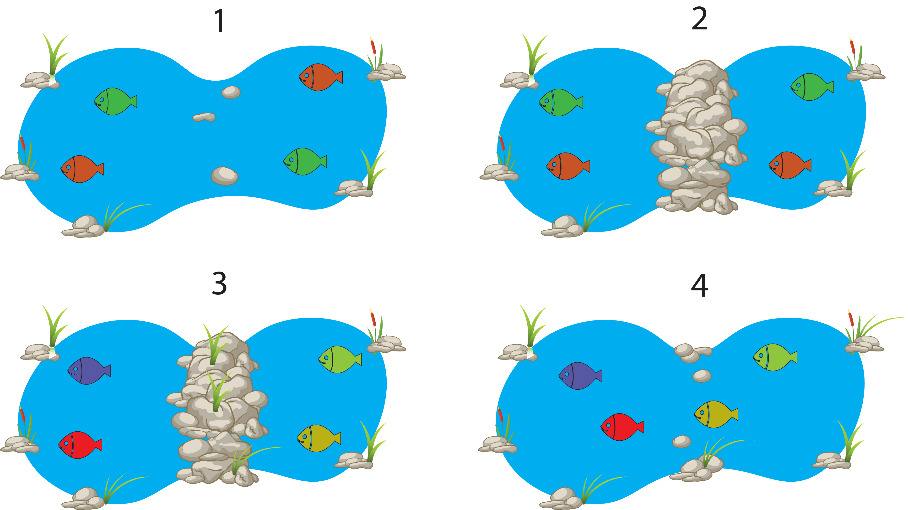

<style>
.small-code pre code {
  font-size: 1em;
}
</style>

The Error We Make When Inferring A Phylogeny
========================================================
author: Richel J.C. Bilderbeek, Thijs Janzen, Giovanni Laudanno
date:
transition: rotate
autosize: true


[https://github.com/richelbilderbeek/tres_presentation_20191016](https://github.com/richelbilderbeek/tres_presentation_20191016)


Biology: which species lived when?
========================================================


What we measure in the field
========================================================


What we infer
========================================================

A posterior


***

A consensus tree


What is the error we make?
========================================================

The possible true tree


***

What we inferred


Tool to quantify this error
========================================================


```r
library(pirouette)
```

 * `pirouette`
 * R Package
 * GPL-3 license
 * [https://github.com/richelbilderbeek/pirouette](https://github.com/richelbilderbeek/pirouette)
 * Used to do all experiments in this presentation

Quantify the error
========================================================


Biological relevance
========================================================

 * We do inference with standard models
 * These standard models may not suffice in all contexts
 * With `pirouette` we can measure the error caused by mismatch
   between using a standard model when (the simulated) nature follows
   a different one


Using a PBD model
========================================================


Caveat
========================================================

Error is caused by
 * Stochasticity in alignment simulation
 * Stochasticity in posterior trees
 * Mismatch between true speciation model and the one assumed

We can remove this mismatch: *Twinning*

Twinning
========================================================


***


Twin pipeline
========================================================


Comparing errors
========================================================

Full error:


***

Baseline error:


Biological interpretation of true and twin error distribution
========================================================

Two distributions are ...|then our inference is ...|due to ...
-------------------------|-------------------------|----------------
Very simular             |as good as we can        |the standard speciation priors being good enough
Very different           |bad                      |using the wrong speciation prior
In between               |disputable               |using the wrong speciation prior

Case study: Multiple birth model / Crowded phylogenies
========================================================

 * By Giovanni Laudanno, Richel J.C. Bilderbeek and Rampal S. Etienne

Case study: Multiple birth model / Crowded phylogenies
========================================================


* Speciations occur in bursts
* Process is poorly understood

***


Case study: Multiple birth model / Species pump
========================================================



* Changes in connectivity promote speciation
* Species pump hypothesis

Case study: Multiple birth model / Process
========================================================

&nbsp;

&nbsp;

* $\lambda$ is the per-species speciation rate
* $\mu$ is the per-species extinction rate
* $\nu$ is the environmental change rate
* $q$ is the per-species speciation probability when an environmental change occurs

***


Case study: Multiple birth model / Parameter choice 1
========================================================


***


Case study: Multiple birth model / Parameter choice 2
========================================================

[picture absent]


***

[picture absent]


Case study: substitutions at the nodes
========================================================

 * by Thijs Janzen, Rampal Etienne & Folmer Bokma

Non-constant substitution rates
========================================================
* Problem: number of substitutions across branches is often not the same:

<div align="center">

</div>

        Moorjani et al. 2016 PNAS

Bayesian Solution
========================================================
* Implement different clock rates, e.g.:
  * along some branches, substitutions accumulate faster, along others slower
  * but overall, all substitution rates are drawn from the same distribution

<div align="center">

</div>
              https://beast.community/clocks

Biological interpretation lacking
========================================================
Here, I propose an alternative explanation:
* branching (speciation) events generate additional substitutions
* a higher accumulated number of substitutions is indicative of past branching events that can no longer be measured, e.g. speciation events followed by extinction


Approach
========================================================
* Before implementing the full likelihood into BEAST
  * use pirouette to test if the two node substitution models affect tree inference at all
  * check what substitution rate model is favoured when using a node substitution model

Proposed Node Substitution model
========================================================
<div align="center">

</div>


Results: Error
========================================================
<div align="center">

</div>

Results: Substitution rate
========================================================

Conclusions and outlook
========================================================
* node substitutions significantly affect tree inference
* node substitutions reflect a relaxed clock model

<br/>


* investigate effect on non-balanced trees

<br/>

* formulate likelihood function
* create BEAST module

Conclusions
========================================================

 * `pirouette` shows the error we make in phylogenetic inference
 * We can prove show inference models do not work in all theoretical cases
 * Yet unknown to what extent (MBness, nodeSubness) these cases are present in nature

Questions
========================================================

?
