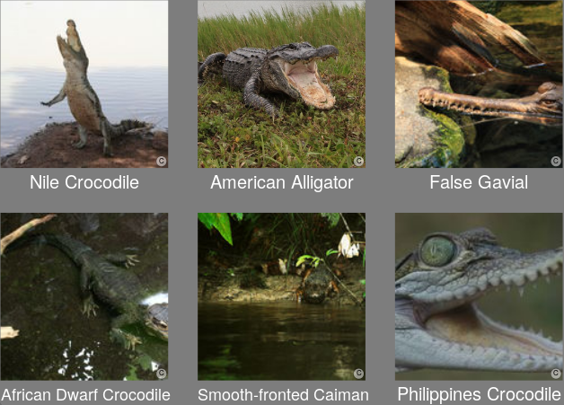

<style>
.small-code pre code {
  font-size: 1em;
}
</style>

The Error We Make When Inferring A Phylogeny
========================================================
author: Richel J.C. Bilderbeek, Thijs Janzen, Giovanni Laudanno
date:
transition: rotate
autosize: true


[https://github.com/richelbilderbeek/tres_presentation_20191016](https://github.com/richelbilderbeek/tres_presentation_20191016)


Overview
========================================================

Will be deleted before the actual presentation

 * 0-5 min: me: biological stuff
 * 5-15 min: me: pirouette's workflow, twinning
 * 15-20 min: (Giovanni) MBD: biology in a bit more detail, preliminary results
 * 20-30 min: (Thijs) nodeSub: biology in a bit more detail, difference with 'normale' pirouette pipeline, preliminary results

Biology: which species lived when?
========================================================



What we measure in the field
========================================================


What we infer
========================================================

A posterior


***

A consensus tree


What is the error we make?
========================================================

The possible true tree


***

What we inferred


Tool to quantify this error
========================================================


```r
library(pirouette)
```

 * `pirouette`
 * R Package
 * GPL-3 license
 * [https://github.com/richelbilderbeek/pirouette](https://github.com/richelbilderbeek/pirouette)
 * Used to do all experiments in this presentation

Quantify the error
========================================================


Biological relevance
========================================================

 * We do inference with standard models
 * These standard models may not suffice in all contexts
 * With `pirouette` we can measure the error caused by mismatch
   between using a standard model when (the simulated) nature follows
   a different one


Using a PBD model
========================================================


Caveat
========================================================

Error is caused by
 * Stochasticity in alignment simulation
 * Stochasticity in posterior trees
 * Mismatch between true speciation model and the one assumed

We can remove this mismatch: *Twinning*

Twinning
========================================================


***


Twin pipeline
========================================================


Comparing errors
========================================================

Full error:


***

Baseline error:


Biological interpretation of true and twin error distribution
========================================================

Two distributions are ...|then our inference is ...|due to ...
-------------------------|-------------------------|----------------
Very simular             |as good as we can        |the standard speciation priors being good enough
Very differeny           |bad                      |using the wrong speciation prior
In between               |disputable               |using the wrong speciation prior

Case study: MBD
========================================================

 * max 5 minutes, by Giovanni: biology in a bit more detail, preliminary results

Case study: nodeSub
========================================================

 * max 10 minutes, by Thijs: biology in a bit more detail, difference with 'normale' pirouette pipeline, preliminary results

Questions
========================================================

?
