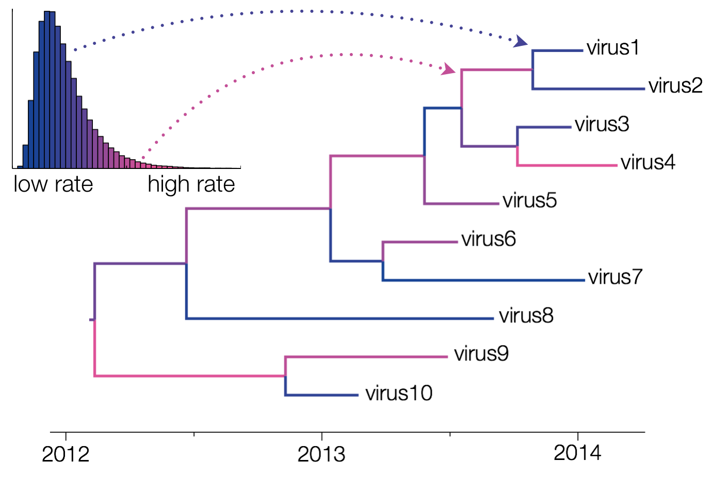
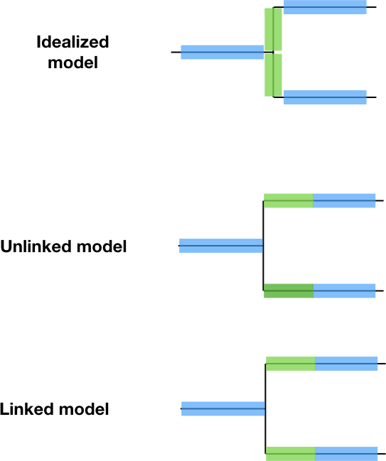
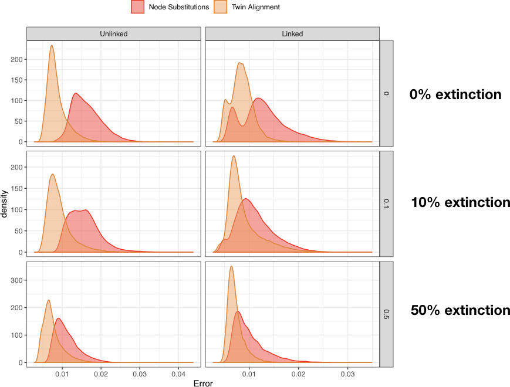

Case study: substitutions at the nodes
========================================================
author: Thijs Janzen, Rampal Etienne & Folmer Bokma
date: 14-10-2019
autosize: true

Non-constant substitution rates
========================================================
* Problem: number of substitutions across branches is often not the same:

                            Moorjani et al. 2016 PNAS

Bayesian Solution
========================================================
* Implement different clock rates, e.g.:
  * along some branches, substitutions accumulate faster, along others slower
  * but overall, all substitution rates are drawn from the same distribution

              https://beast.community/clocks

Biological interpretation lacking
========================================================
Here, I propose an alternative explanation:
* branching (speciation) events generate additional substitutions
* a higher accumulated number of substitutions is indicative of past branching events that can no longer be measured, e.g. speciation events followed by extinction

Proposed Node Substitution model
========================================================

Approach
========================================================
* Before implementing the full likelihood into BEAST
  * use pirouette to test if the two node substitution models affect tree inference at all
  * check what clock model is favoured when using a node substitution model

Results: Error
========================================================

Results: Clock model
========================================================

Conclusions and outlook
========================================================
* node substitutions significantly affect tree inference
* node substitutions reflect a relaxed clock

 

* investigate effect on non-balanced trees

 

* formulate likelihood function
* create BEAST module

